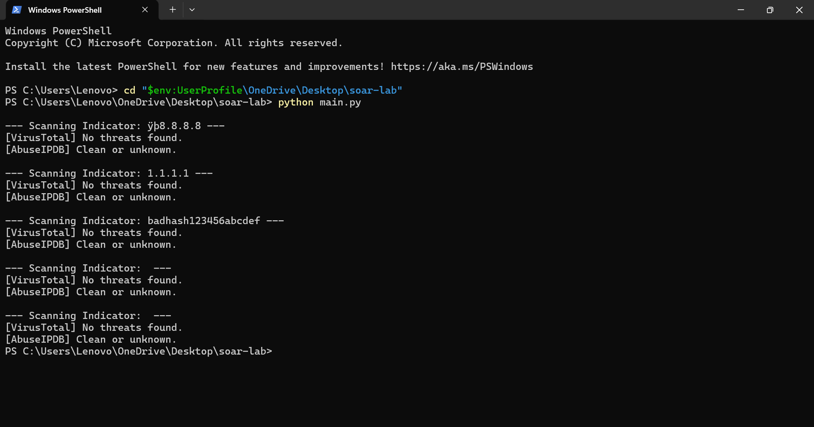
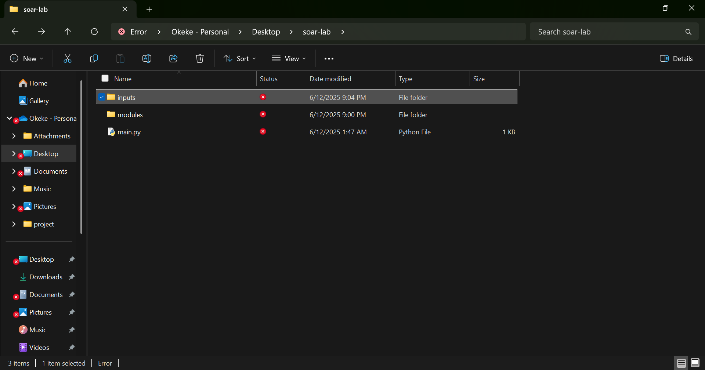

# 🛡️ SOAR Lab Simulation with AbuseIPDB and VirusTotal

This project simulates a Security Orchestration, Automation, and Response (SOAR) workflow using Python. It scans suspicious IP addresses and file hashes using public APIs from **AbuseIPDB** and **VirusTotal**, then outputs results in a readable format. Ideal for Security Analysts, Threat Hunters, and Cybersecurity Enthusiasts.

---

## ⚙️ Features

- 🚀 Automates threat intelligence lookups
- 📡 Supports IPs and hash-based indicators
- 🔗 Integrated with AbuseIPDB and VirusTotal APIs
- 📂 Modular architecture (easy to extend)
- 🧪 Reads input from `inputs/suspicious_indicators.txt`

---

## 🧠 How It Works

1. User provides a text file of suspicious indicators.
2. Each indicator is scanned using:
   - ✅ [AbuseIPDB](https://www.abuseipdb.com/)
   - ✅ [VirusTotal](https://www.virustotal.com/)
3. Results are printed to the console for review.

---

## 🗃️ Project Structure

soar-lab/
├── inputs/
│ └── suspicious_indicators.txt
├── modules/
│ ├── abuseipdb.py
│ └── virustotal.py
└── main.py

yaml
Copy
Edit

---

## 🔧 Installation

> 💡 Make sure you have Python 3 installed.

```bash
git clone https://github.com/cyberkensec/soar-lab.git
cd soar-lab
pip install -r requirements.txt  # If you have one
Note: You may need to insert your own API keys inside the modules for real-time access.

🚦Usage
Prepare your input file:

text
Copy
Edit
8.8.8.8
1.1.1.1
badfilehash1234567890
Then run:

bash
Copy
Edit
python main.py
🖼️ Screenshots
 
🌐 APIs Used
VirusTotal API

AbuseIPDB API

👨‍💻 Author
Kenechukwu Okeke
GitHub: @cyberkensec

🧠 Ideal For
- Intermediate to Advanced Cybersecurity Practitioners
- SOC Analysts looking to automate workflows
- Cybersecurity Portfolios demonstrating SOAR capabilities
- Candidates preparing for Blue Team and Security Automation roles


📜 License
This project is open-source and free to use under the MIT License.
